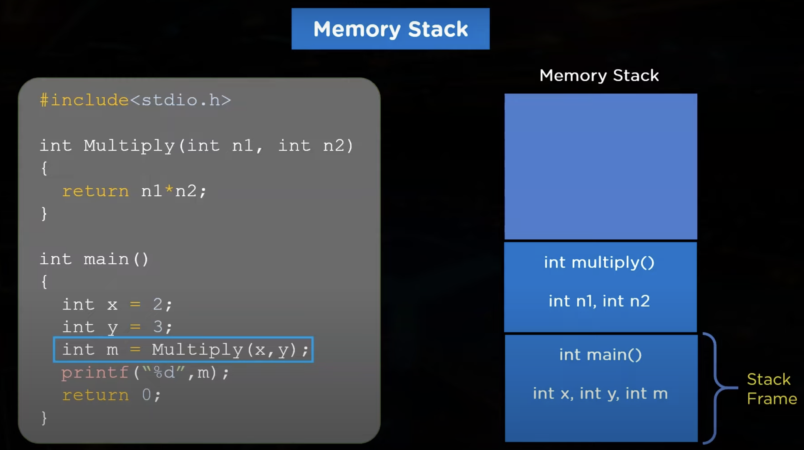
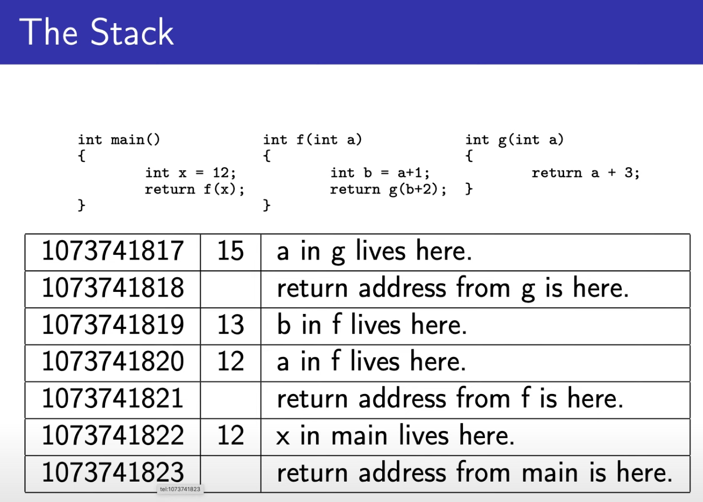

# Lecture 1

## I/O in C
the `argc` and the `argv` is the equivalent as the args in java

argv is used to tell us how many elements we have in argv.
There is a convention that the last string pointer in argv is a null-pointer.
```c
// C-code
#include <stdio.h>
int main(int argc, char** argv)
{
    int a;      // %d
    float b;    // %f
    double c;   // %lf
    //string is %s, and char is %c

    // scanf is a function that reads a value and puts it into a memory adress. a is not an address but a value, we use the &-operator to access the address
    scanf("%d, %f, %lf\n", &a, &b, &c);
    printf("%lf\n", a + b +c);
}
```
```java
// Equivalent example in java
public class main{
    public statis void main(String[ args]){
        // Bla bla...
    }
}
```


## Writing to a file
```c
int main()
{
    FILE* fp;

    // We use the "w" to write to the file, if we want to read it we use "r"
    fp = fopen("data.txt", "w");

    // we should check that fp is not null, since the file "data.txt" might not exist
    printf(fp, "%lf\n", a + b +c);
    fclose(fp);


    // read the file
    fp = fopen("data.txt", "w");
    scanf(fp, "%lf\n", &a, &b, &c);
    fclose(fp);
}
```


## Arrays

- `calloc`is used for reserving memory. Here are three examples of how to create arrays in c.
- `malloc`is also used for allocating memory.
the difference between `calloc`and `malloc`is that calloc initializes the value in the memory address to be 0, whereas the malloc doesn't. the value in the memory address that malloc allocates is undefined.
  
`Example 1` of allocating memory for a n-sized array. `b`is a pointer here.
```c
int* b;

b = calloc(n, sizeof(int));
for(int i = 0; i < n; i+= 1){
    b[i] = i;
}
free(b);
```  
<br>
<br>

`Example 2`of creating an array:
```c
int a[10];  // array of length 10
```
<br>
<br>

`Example 3` of creating `variable-sized array`. The compiler doesn't need to know the length of the array:
```c
int size = 10;

int main()
{
    int c[size];
}
```
<br>
<br>

## Struct
- `C` doesn't have classes. `C` instead has `structs`. A struct is basically a class where everything is public, and no methods exist. A struct can unlike classes in java be either a pointer or the actual object itself depending how you initialize it. when you create a new instance of a class in java (a object), it's the `new`keyword that returns the address to the object.

 <br>

- A struct is essentially just a collection of variables.
- To implement a new struct, you use the `struct` keyword, choose a fitting name and implement it within { }.

```c
struct s {  //this is a tag
    int a;
    int b;
} s;        //variable identifier
```

- this struct is of type `s`. 

- the struct `s` contains a and b here. in java we would say that a class references a and b. We can also create pointers to structs though.
<br>

## How can we know the difference between a pointer and a struct in c?
- since there is no star its no pointer.
- if there is a star we know its a pointer.
- there is no need in java to declare that an object is a pointer, because that is always the case. whereas in c, the struct can be the actual object aswell as a pointer to the struct.
<br>

`Example` of creating a struct with a reference to a struct of the same type. This is possible since all the compiler has to know is the size of the pointer `next` which is the same as for all data-pointers. Meaning the compiler doesn't have to know anything about the `struct` that is yet to be implemented.
```c
struct list_t {
    struct list_t* next;
    int a;
    int b;
};

int main()
{
    s = calloc(1, sizeof(*s));
}
```
<br>

in java we dont have to specialize that an attribute is a pointer because the compiler understands it.
```java
class List{
    // compiler understands that next is a pointer
    List next;
    int a;
    int b;
}
```
The code above would give compilation error in c. In c we must speicfy that the next is a pointer.


- You should use `calloc()`to initializa a struct with a null-pointer. This is because calloc sets all intial values to `0`, and a pointer that has the value `0`in `C`is a `NULL-pointer`.

- `NULL` in c is defined to be the number 0.
<br>


# Memory

The memory of an application is stored into three main parts.
1. machine code
2. stack
3. heap

## machine code
the machine is where your application is converted into instrucitons that yout computer understands.

## the stack
the stack is declared with a certain amount of memory when the program is created, so if not careful you can overflow the stack.

all local variables are stored in the stack. Local variables are all variables that are stored in a specific function. The stack dealocates all memory used for local variables when the function is done.

the return adress is stored in the stack, so the program knows where to return after the function is done.


the amount of memory allocated on the stack for the main-method is called the stack main frame, and it is allocated when the program is compiled.
After the `Multiply`-function is called, the stack frame for the `Multiply`-function is allocated. The stack frame for the `Multiply`-function is deallocated when the function is done.


another example:



## the heap
malloc and calloc are used to alloacte memory on the heap, and free() is used to deallocate memory.

The size of the heap is not fixed and change during runtime. There are no rules for the allocation and deallocation of memory on the heap, this gives the programmer more responsibility.

- `heap-overflow` is when the operating system is unable to provide more memory to the heap. Nowadays the operating system contain lafge of amounts of memory so the heap-overflow is not as common as it used to be.
  
## Pointers

- A pointer is an adress that saves the adress its pointing to in its adress.

- in java `new`returns the adress of a newly created object. This doesn't exist in c. instead malloc and calloc are used to allocate memory.

- if the type of the parameter you want to change in a function is a pointer. you have to use two **, like this:
```c
void f(int** a)
{
    *a = NULL;
}

void g()
{
int* b;
f(&b);
}
```
here were sending in the adress of the pointer `b`  to the function `f()`. 
We're then accessing the the adress the pointer `a`is pointing to, and changing it.

- A disandvantage with pointers is that they're confusing `compilers`.

Example of accessing addresses and values in c:
```c
int main(){
    int a = 5;      // a is a variable with the value 5
    int* b = &a;    // b is now pointing to the adress of a
}
```
- a is a value. where as b is a pointer that has stored the address of the value a.

### accessing values and addresses
```c
// accessing values
    a;     // value of a (a value)
    *b;     // value of a (a pointer)

// accessing addresses
    &a;     // address of a (a value)
    b;      // address of a (a pointer)
```


### examples of functions taking pointers as input
```c
void f(int* a)
{
    *a = 5;   // changing the value of a
}

void g(int** a)
{
    *a = NULL;  // changing the adress of a
}
```

<br>

## How a function can return several values using pointers
- returning a struct is usually implemented by the compiler as sending the destination adress as an argument. It's impossible to know which is better between f() and g(). only way to know is to measure.

```c
//version 2
struct s f()
{
    struct s a;
    a.x = ...;
    a.x = ...;
    a.z = ...;
    return a;
}

// version 1
void g(int* x, int* y, int* u)
{
    *x = ...;
    *y = ...;
    *z = ...;
}

int main()
{
    // what the compiler actually sends in to the function f() here 
    // is f(&t). But this is something we don't write out.
    struct s t = f();   
}
```

In java the keyword `new` is used to create a new object, and the adress of the object is returned. This does not exist in c. Instead we use `malloc` and `calloc` to allocate memory, but you can also write your own functions to allocate memory.
<br>
<br>

## Arrays vs Pointers
- Array is a sequence of elements. An array can not start pointing to a new array, and is immutable.
- Pointer is a box containing the adress of something.
- When you send in an array to a function, it's actually just a pointer to the array you're sending in. This is to avoid, having to copy large arrays. The compiler can in this way make the program a lot faster. `below is an example of this:`
  ```c
  //written code
  int fun(int a[], int b[12], int c[3][4]);

  //compiled code
  // this means the number of the elements is ignored
  int fun(int* a, int* b, int (*c)[4]);

  int main()
  {
    int x, y[12], z[4];
    fun(&x, y, &z);         //valid call to fun()
  }
  ```
when the compiler translates:
```c
int c[3][4]  ->   int (*c)[4]
```
it ignores the number of rows. c points to an unknown number of rows with 4 elements in each row.


### array vs pointer
If we have an array and a pointer pointing to the first element of the array we can acces the elements of the array in two very similar ways:
```c
int a[10];
int* b = a;

    a[0] == b[0] (or *b);   // true
    a[1] == b[1] (or *(b+1)); //true
    ....
    a[n] == b[n] (or *(b+n));   // true


    int c[3];
    a = c; // this creates a compilation error
    b = &c; // this is valid
```

<br>
<br>

### Iterating matrices efficiently
- if we have an array, called `a` of length 4. and a pointer `int* b`.
  then if `*b = a[1]` -> `b[1] = a[2]`

- c has `row-major`matrix memory layout. this means that a matrix is stored in memory one row at a time. the most efficient way to iterate a matrix in c is therefore row-for-row, since we're accessing all the neighbouring values before jumping.
```c
for(int i = 0; i < row; i += 1){            //iterating row
    for(int j = 0; j < column; j += 1){     // iterating column
        //  acces matrix[i][j]
    }
}
```
we want to iterating the matrix in this manner since to the values on the same row are stored closer to eachother than the values on the same column. We basically don't want to jump "back and fourth" in our memory.

<br>

- `Example`, this fun(int c[3][4]) will print "8 16" why is that,

```c
int fun(int c[3][4])
{
    printf("%zu %zu\n", sizeof c, sizeof c[0]);
}
```
`Answer`: here c will be converted into a pointer, with a size of 8 bytes, and when you type c[0] you access an int in the array, with the size of 16 bytes.
`to be checked`are you actually accessing an array of length 4 with element size of 4 bytes?

- when we print `sizeof` we use the struct `size_t` which is an `unsigned int` thats why we write `%zu`.
<br>
 
## Referencing an element in an array.

### adding pointer + integer
some elements are big and take up more than one memory address. But a pointer will point to the first. This would become a problem when we try to access the next stored element with :
```c
int * ptr = ...;
int a = *(ptr + 1);
``` 
because if a big element occupies many memory spaces next to eachother we will still be on the same element when we add 1 to the pointer. 

C solves this by translating the addition of pointer+integer to `pointer + integer * (sizeof elementInArray)`
```c
*(ptr + 1)    ->    *(ptr + 1 * sizeof(element)) 
```
`address + integer` -> `address + integer * (sizeof elementInArray)`

```c
*(ptr + i) == *(i + ptr) // true
a[i] == i[a] // true
```

<br>

## Summary video

there are four ways to allocate memory for datastructure:

1. `Static` means a variable is bound by the file scope. Otherwise it's global which means its accessable from other files aswell. Global variables can easily create interferens between classes.
2. `Stack variables` really easy for the compiler to use. it takes 0 clockcycles to put them in registers, since they are already in registers when they're going to be used.
3. alloca(size_t size) takes memory from the stack, the memory is then freed when the program returns from the function.
4. malloc()/calloc() takes memory from the heap
   
- it is possible to use a `struct` as a parameter and a return value, unlike an `array`
- when we return an `array`, we instead return a pointer to the first element.
- stack variable contain an undefined value to start with.

### memory errors
two good tools to avoid errors are valgrind and google sanitizer.
- access data through pointer that doesn't point to anything, in that casr the program will crash.
- index out of bounds
- forget to free, this is called a memory leak.
- free twice. the program will crash.

## Global variables and functions
a variable or function is global if it is not written within a function. all functions in c are therefore global.
- visible from other source files. it is called that they have external linkage.
```c
// global
int a;
int y = 1;
int f(){return x * y;}
```
it is often best to avoid global variables since accessing them is often slower than accessing local varibles. and they sometimes make the program harder to understand.

### static variables
are similar to global variables but can inly be accessed wihtin one source-file. they are only visible within theier scope. static variables avoid conflicts in names between different files.

static variables are stored in the data-segment, and are initialized to 0.

always use static if it is not needed to be global.
```c
static int c;
static f(){return x * y;}
```

### stack variables
- easy for compilers to use efficiently
- avoid using huge arrays

stack variables are not initialized automatically, just garbage. when using an uninitialized value the compiler may complain but it is not for sure.

if compiling the program with the optimizer flag the compiler have a higher chance of recognising that a variable was used without being given a value:
```c
gcc -o2 a.c
```


```c
int a[10];
int* f(){return a;} // ok

int* g()    
{
//the array the pointer we return is pointing to, disappears when the function is done.
    int a[10];
    return a;   // bad idea
}
```


<br>

`Example` 
```c
int     a[10] = {1, 2, 3}
```
this will become an array with `1, 2, and 3` as the first three values, the rest will be set to `0`
<br>

### alloca()
- `alloca` is very fast, and much more efficient than `malloc` and `calloc`. `alloca` takes memory from the `stack`. we start from the top of the stack and work our way down. if we continue to long though the program will crash. 
- alloca moves the stack pointer down to free more space 
- the serious problem with `alloca` is that if we request memory from the stack which is occupied by the heap we will get it. So it's important to know how much memory the heap uses.

<br>

- `void*` is data that can represent any datatype, similar to javas object type. That means we don't have to make a conversion from a `void pointer` to an `int pointer` since they are represented the same way.
- `realloc` is a way of changing the already allocated memory, for example the size of the allocated memory


### free-list
since malloc/free takes a lot of time, it can be better sometimes to use free-list.

when memory is not needed anymore, a pointer from the current free-list is added to the memory address that we otherwise would hava freed, using the first word of each unallocated region as a pointer to the next.


### sizeof