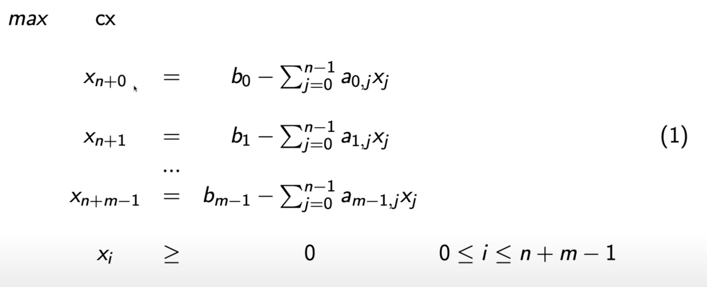
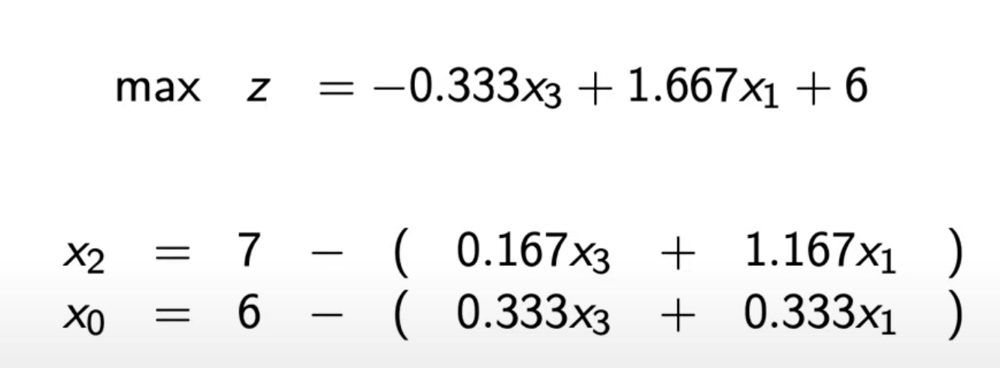
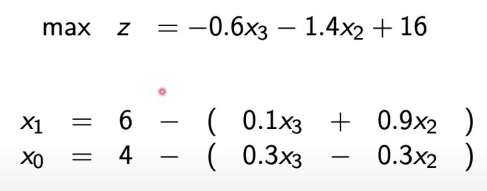

# Linear program
- maximize a linear function in a given region.
- simplex method optimizes a linear program, without the constraint the the numbers must be integers.
- The region is the defined as with linear lines as: 

    ```haskell
    (A) 4= -x0/2 + x1
    (B) 18= x1 + 3x0
    (C) x0 = x1 >= 0```
- the function to optimize can look something like: 
  ```haskell
    max z = x0 + 2x1
    ```
- the X-values are called the `decision-variables`
- what is written above can be rewritten with matrices like:
  ```haskell
  -- A is a matrix, X are the decision variables and b is a vector
    max z = cx = c0 * x0 + ... cN * xN
    A x <= b 
    x >= 0
    ```
- each constraint defines a halfplane
- where halfplanes instersect is called a `vertex`
- A linear program is either:

    `infeasible`: if the region P is empty,
    
    `unbounded`: if no finite solution exists
    
    `feasible`: is an optimal solution `x ∈ P`, which maximises z.
- there can be multiple optimal solutions, but it is sufficient to find one

### Theorems:
(A): a local optimum of a linear program is also a global optimum. 
- Meaning if we find a local optimum we can stop.


(B): for a bounded feasible linear program with a feasible region P, atleast on vertex is an optimal solution.
- Meaning it is sufficient to check only the vertices and take the best one. Sometime there exist too many vertices to check all however, this is because there can be houndred of thousands...
  
  <br>


# Simplex Algorithm
- We start in a vertex and then go to neighbouring vertex until all coefficients are negative, which gives the optimal solution.

- when working with linear programs in a computer it is easier to work with equalities instead of inequalities. To represent the linear program without inequalities we introduce more variables.

we rewrite our previous conditions as this:


- the newly introduced variables to the left in the picture are calles `slack-variables`, all other variables are called `decision-variables`.

- the variables on the left hand side are called basic-variables, they occur only once.
- the varaibles on the right hand side are called non-basic variables
- the objective function only contains non-basic variables.

## Method
1. select a non-basic variable that has a positive coefficient. The first nonbasic variable we select is called the `entering-point`.

2. we then switch place between the nonbasic variable and it's corresponding basic variable. This means we have to rewrite our objective function (that we want to maximize) in terms of the basic variable, as well as our other condition statments.
3. We repeat steps 1 and 2, until all variables have a negative coefficient, as this mean we shouldn't increase any of them. The constant term is then the optimum as we should set the negativly cofficient variables to zero.

## Example of Simplex:

### Step 1
first we select x0 as our entering variable since it has a positive coefficient in the objective function.

We then look which nonbasic variable that constrains it the most. In this case it is x3.

This means we want to substitute x0 with x3

### Step 2
When we now look at our objective function we see that we can't select x3. because of it's negative coefficient it would not be beneficiary to increase it's value. We therefore select x2 and do the same thing as in step 1.



### Step 3
all variables in our objective function now have negative coefficients. To find the greatest value we therefore don't want to increase any of them, but rather setting them to 0.

we can see that when we set them to zero, z(x) = 16, our constant. This is the optimum.

To get what x values generate this optimum we insert x3=0 and x2=0 in our condition functions. We can clearly see that x1 is then equal to 6 and x0 is equal to 4.



### note 
in this system it turned out that the decision variables became the basic variables in the end. That is not always the case. If a decision variable is a nonbasic variable it will be 0.


# Branch and Bound
integer programming is similar to linear programming with the difference being that the solution has to be an integer.
- some problems like this are NP-complete and have no good solution. The only solution might be to enumerate all possible solutions (bad).

`Branch and bound` is an algorithm used to try and sole some integer programs, by limiting a search-tree. doesn't work on all integer programs. The goal of branch and bound is to find a x ∈ N, that minimizes or maximizes an objective function ƒ(x).

- branch and bound is often used to minimize a function, but since finding the minimum of -ƒ(x) is the same as finding the maximum, this is no problem.

## Method

1. To solve the the integer programming we relaxe the problem to just solving the linear program, meaning the best value doesn't have to an integer. We do this by using the simplex algorithm.

  - if the answer is an integer we can limit the search-tree and dont need to expand from the node. So we have succeeded if this happens on our first try.
  - if the answer u ∉ ℕ, we want to branch by starting two new linear programs with the constraints below. We than evaluate the answer to see it is an integer or if we must exoand from the node.

We continue this until the have no more nodes we can expand on.
```haskell
-- Program 1
constrain the region to x ≤ ⌊u⌋

-- Program 2
constrain the region to x ≥ ⌈u⌉
```
(each of these problems are solved directly with the simplex algorithm)

if we find a new optimal solution after some iterations, we remove all nodes (that are to be explored) if they're less than the integer value we found. `(i think)`

To optimize the efficiency we delete old nodes to save memory. We always save the node with the current best solution however