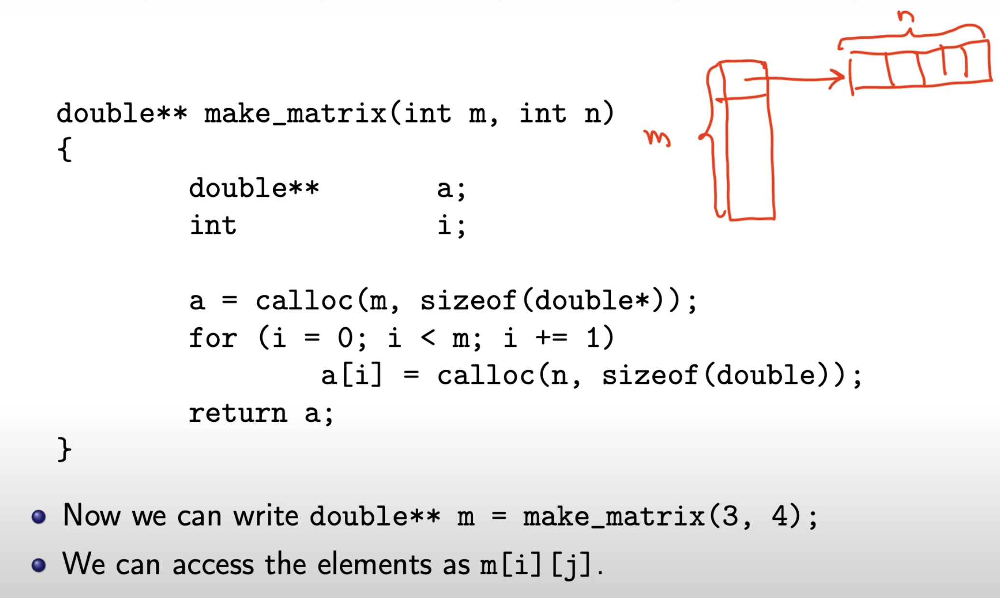
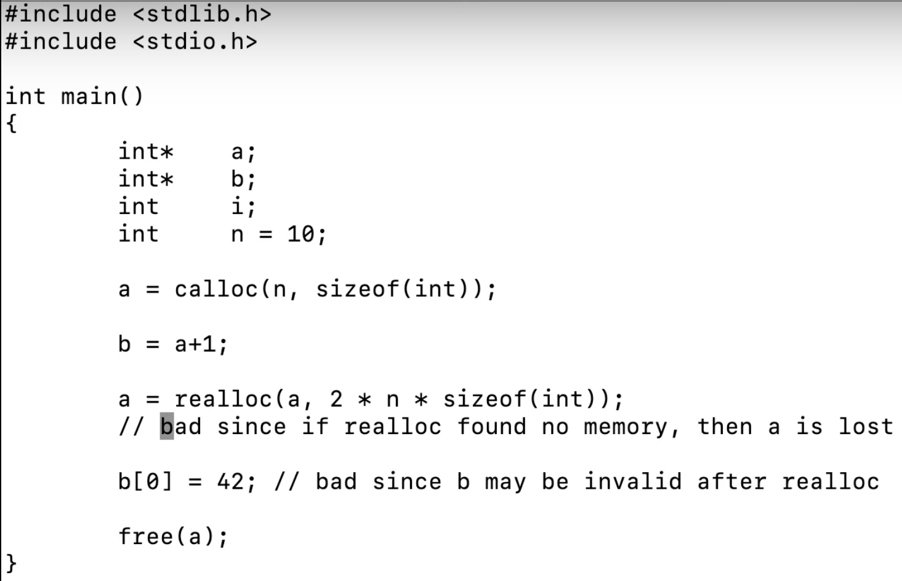

# contents lecture 3
- arrays, matrices and lists
- introduction to the ISO C standard, (chap 7)
- lexical elements, (chap 8)


# matrices
c has no concept of multidimensional arrays, so instead we use arrays of arrarys...

Below m is an array with three elements where each element is an array of four doubles.
```c
double m[3][4]
double x[2][3][4][5]
```


### allocating memory to an array
this can be used as if it was an array
```c
a = calloc(n, siezeof(double))
a[i]
```

### declare mulitdimnensional array
we use the same number of pointers(*) as we need dimensions:
```c
double** m;
```

The rows in the image below will be placed in different parts of the memory which isn't ideal.


- but instead of making m+1 calls to calloc()
 we can make one big one:
```c
double* a = calloc(n*m, sizeof(double))

// cant acces like this now
a[3][2]

//instead we have to do like this:

// a[i][j] =>
for (i = 0; i < row; i++){
    for (j = 0; j < col; j++){
        a[i * col + j]
    }
}
```


# calloc and malloc
the first time a program sees data from the heap/stack, whenever that happens the operating system will set that data to zeros.

`why do we want this?`: say someone is logged in to a computer and have written a password somewhere in the memory.
if someone else then starts a program and calls malloc() and gets that data with the password it is really bad. that's why operating systems set new data to 0.

after a while when we we access previously freed data, we will get what was previously stored there.

- this can be bad since it may prevent us from finding bugs in our program when the OS sets all data to zeros in the beginning. 
- if we we have a node that we for example assume is null when we access, and we forget to right the code that sets it to null. It might work in the beginning of the program, but not when the program has run for a bit.

using malloc() but forgetting to initialize data can lead to painful bugs. valgrind can help finding them.

## realloc()
realloc() can be used to extend (or shrink)the memory area that an existing pointer is pointing to. if that is not possible it allocates new memory
```c
void* realloc(void* pointer, size_t size)
```
realloc() can be dangerous, because if it fails to find more memory it returns null, and we loose the pointer. it is therefore better to save a pointer to our old memory and first check if we got back null from realloc(). if realloc() is successful however our old memory if freed.

### example of dangerous use of realloc()
b will be pointing to the same address after realloc(a,...). this is problematic because all the data might have been moved, or everything might have been set to null.


## avoiding problems with realloc()
by just having one pointer pointing at the beginning of arrays, and not having pointers that point into the array we avoid these problems.

(realloc can be useful in assignment word)


# making a list-node
### example of cirular dubbellinked-list
without the typedef we would have to right `struct list_t` instead of just `list_t`.
```c
// this line defines "list_t" as a synonym to "struct list_t"
typedef struct list_t list_t;

struct list_t {
    void* value;
    list_t* next;
    list_t* prev;
};

list_t* new_list(void* value){
    list_t* node = malloc(sizeof(list_t));

    // the arrow is a short-hand for (*node).value
    node->value = value;  // (*node).value
    node->next = node;   // (*node).next
    node->prev = node;  // (*node).prev
    return node;
}
```


# freeing of a circular-list
```c
void free_list(list_t** head)   // head is a pointer to a pointer
{
    list_t* node = *head;   // node is a pointer to the first node
    list_t* p;
    list_t* q;

    if (node == NULL)
        return;
    p = node->next;
    while (node != p)
    {
        q = p->next;
        free(p);
        p = q;
    }
    free(p);
    *head = NULL;   // set the pointer to the first node to NULL
}
```

# Strings in C
strings consist of a number of characters adjacent in memory, terminated by a null character '\0'.

- "C is fun" contains 9 bytes, 8 chars and 1 null char.

we can put strings into arrays of chars, but we can also use pointers to chars. A pointer isn't a string though.

### String literal
a string literal is a constant that we right in the source-code. it is typically in a part of the memory that is read-only. 

every OS has pages which are usually memory chunks that are 4 bytes (sometimes 8 bytes), these can be set to read-only or other things.
```c
//global variable
char* s = "c is fun";

// this will give a segmentation fault since we are trying to write to a read-only memory
*s = 'C'; 
```

### arrays of characters
this string will not be part of the program when it runs. The purpose of a string like this is only to tell the compiler what to put into the array.

it is not neccessary to define the length of the array, when you input a string right away, then the compiler can figure out the length of the string.
```c
// not a string-literal but a string
char s[10] = "c is fun"; // 10 elements
char s[] = "c is fun"; // 9 elements
char s[8] = "c is fun"; // 8 elements, work but dangerous
// this will work
s[0] = 'C';
```


## copying a string
```c
char* copy_string(const char* s){
    size_t length;
    char* t;

    length = strlen(s);
    t = malloc(length + 1); // +1 for the null character
    if (t != NULL)
        strcpy(t, s);   //library function
    return t;
}
```

### implementing strlen()
note: you can also do this by calculating the end-address and then subtracting the start-address.
```c
size_t strlen(const char* s){
    size_t length = 0;

    while (s[length] != '\0'){
        length += 1;
        s += 1;
    }
    return length;

}
```

# ISO-standard
- `Implementation` is the C-compiler provided with the standard library.
- there are requirements on what the compiler must complain about, and what it must not complain about. how the error messages are done are completely up to the compiler.
- if a `constraint is violated` the compiler must give a diagnostic message.
- `Semantic`: The behavior of the language construct is usually described in the semantics.


# Implementation defined behavior
this refers to behavior that is not defined by the c-standard but buy the compiler. it refers to behavior that may vary between on different implementations of the language. A program is said to contain implementation-defined behavior if it is possible to write the program that produces different results on different compilers.
- allows the compiler to choose the behavior that is most efficient for the target platform.
- it must be documented in the compiler-documentation.

### why?
c might be used on small embedded system, or on huge supercomputer. on the supercomputer it might be neccessary to have a 64-bit integer, while on the embedded system it might be enough with a 16-bit integer.

this allows for optmization for different hardware.

### example of implementation defined behavior
- the size and precision of various types
- how bit-field is layed out in memory
- wether a right shift of a signed integer is an arithmetic or logical shift

### dangers of implementation defined behavior
portable programs should avoid implementation defined behavior, since we want the program to have the same outcome across all plattforms.


# Unspecified behavior
- here the implementaion (compiler) decides what to do, and does not have to document it, because it can vary either "randomly" because of optimizations.

### example of unspecified behavior
- wether two identical string-literals are stored in the same memory location or not.

- the order of evaluation of function arguments is unspecified. 

# undefined behavior
- "an uggly form of bug"

this occurs when we violate a rule in the standard that is not a constraint. meaning the compiler is not requiered to check it and complain.

### example of undefined behavior
- dereferencing an invalid pointer
- dividing by zero
- array index out of bounds


# Constraints
what chars are we allowed to use in the source code?

all compilers must support the (lower/upper)latin alphabet, decimal digits, and some special characters.

other characters are allowed but not required to be supported by the compiler.

### Keywords
there are about 50 keywords in c. some new keywords have been added in the newer versions of c, all them start with an underscore followed by a capital letter. this is to avoid conflicts with older code. it is really important that old code still works.

when you add certain header file, the new keywords become available without the capital letter and underscore.

## indentifiers
- must start with a letter and not with an underscore.


## Constants
you can add a prefix or a suffix to a number to specify the base of the number.

### integer constants
```c
Ox12 // hexadecimal
O12 // octal
```

### floating point constants
floating point number is by default a double
```c
123.456e12F // float
123.456e12 // double
123.456e12L // long double
```

### good tool to optimize code:
in this program the x value first has to be converted into a double, then added to the double 0.1 and then converted back to a float, and then stored in x.
```c
float x;
int main()
{
    x += 0.1; // 0.1 is double here
}
````
here the two are added and stored in x as a float. which is much more optimal.
```c
float x;
int main()
{
    x += 0.1F; // 0.1 is double here
}
```

### character constants
- there are no such things as character constants in c, it is an integer type, which you can save characters in.
- the type of character constants is int not char.
character constants are stored in their ascii value. this means that character constants behave like int:s.

```c
'a' // 97  (int)
'\n' // 10 (int)
```

